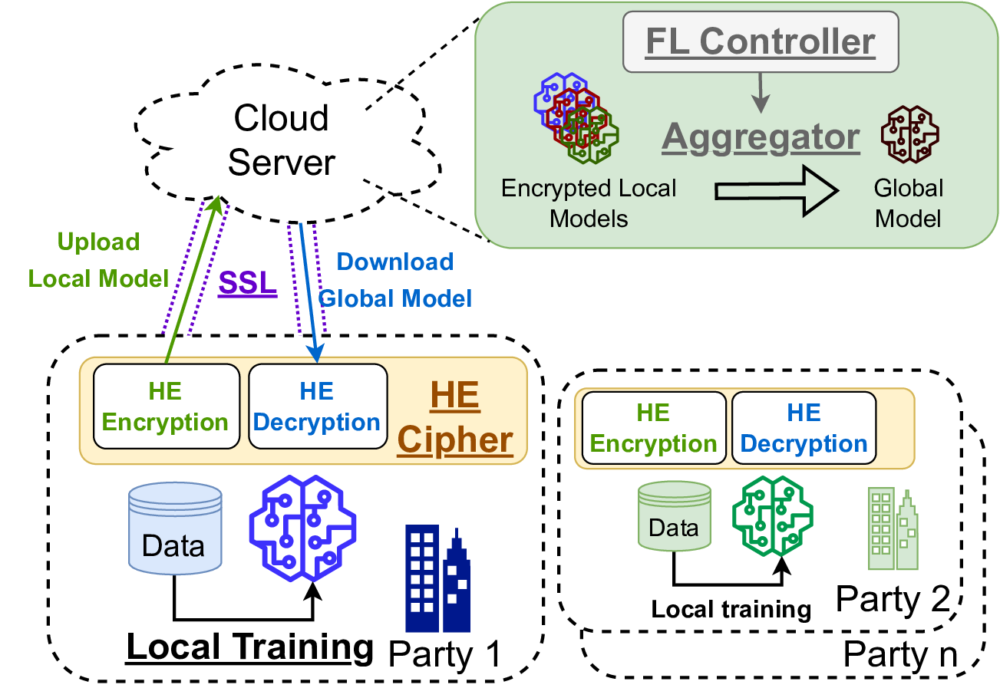
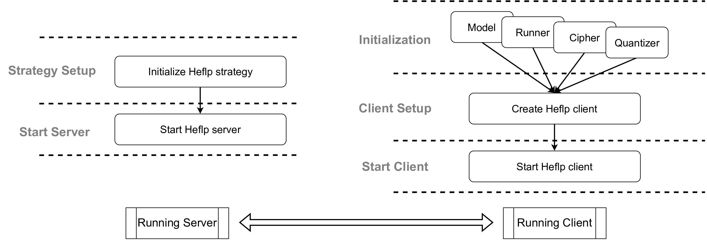

## Introduction

Project name: **HEFLP (Homomorphic Encryption Federated Learning (FLower) Plugin)**

Heflp implements the idea of encrypting the model parameters before uploading and doing the homomorphic aggregation on the server. The aggregated model parameters can be obtained using the same cipher to decrypt the received message on each client. Heflp is based on the [Flower FL framework](https://flower.dev/docs/framework/index.html).

Heflp now supports 4 HE schemes:
1. [Flashe](https://arxiv.org/abs/2109.00675)
2. Flashev2 (with MWAvg, developed in Heflp)
3. [CKKS](https://eprint.iacr.org/2016/421.pdf)
4. [BFV](https://eprint.iacr.org/2012/144.pdf)

> The `Flashe` component refers the original repository: [Flashe Repo](https://github.com/SamuelGong/FLASHE)

> `Flashev2` is developed by us based on the original version of Flashe.

> `MWAvg` is an advanced weighted averaging strategy we developed to mitigate the risk of overflowing. You can find the implementation [here](./heflp/heflp/secureproto/quantization/mwavg.py)

> `CKKS` and `BFV` are realized based on the [Pyfhel](https://pyfhel.readthedocs.io/en/latest/index.html) module 

and two ML frameworks:
1. [Pytorch](https://pytorch.org/)
2. [Tensorflow](https://github.com/tensorflow/tensorflow)

## System Overview



## Project Structure

```
.
├── data
├── heflp
│   ├── heflp
│   │   ├── app.py  # Includes the start_client and start_server function
│   │   ├── info.py # Includes some meta information of Heflp, e.g. supported HEs, Log setting.
│   │   ├── client  # Includes Heflp clients
│   │   ├── secureproto # The secure protocol components 
│   │   │   ├── common
│   │   │   ├── homoencrypschemes   # Homomorphic encryption ciphers
│   │   │   └── quantization    # Quantizers
│   │   ├── strategy    # Includes Heflp strategies
│   │   ├── training    # Convenient tools for ML training
│   │   │   └── runner  # The runners for training and testing models
│   │   └── utils   # Loggers, Perf evaluation tools, etc
├── materials   # Some papers/documents this project refered
├── outputs # Save the output models in this dir
├── scripts # Bash scripts for environment setup
├── src     # Examples of how to conduct secure FL using Heflp
└── test    # Some jupyter notebooks for practicing, drawing, testing, etc
```


## How to start

This section gives the guideline of how to deploy and use this project.

### Prerequisites

1. Python (version >= 3.8)
2. Pip
3. Python3-venv

### Client side

1. First of all clone this project to local environment: `git clone git@github.com:canarybit/canarybit-heflp.git`
2. Run `make` to create the virtual env and prepare dependencies.
> By default in this step all the dependencies (not only Heflp, but also the requirements of the examples in this project (/src)). Please look into the `requirement.txt` for more details and comment those you do not need.
3. Activate venv: `source myvenv/bin/activate` or run `make help` for hints.
4. Run the examples in /src or develop your own programs.
5. Exit venv: `deactivate`

### Server side
1. First of all clone this project to any Linux device: `git clone git@github.com:canarybit/canarybit-heflp.git`
2. Run command `make pack-server` to extract necessary code and pack it to a tgz file (default name is heflp-server.tgz).
3. Copy and paste the tgz file to the server and untar it by `tar -xvf heflp-server.tgz`, then go into the dir `heflp-server`.
4. (Optional) Create virtual env: `python3 -m venv myvenv`
5. (Optional) Activate venv: `source myvenv/bin/activate`
6. Install dependencies: `pip install -r requirements.txt`
> If failed to install PyfHel, please refer to [this tutorial](https://pyfhel.readthedocs.io/en/latest/source/getting_started/1_installation.html) and try it again.
7. Develop and run programs.
8. Exit venv: `deactivate`

## Using Heflp to setup secure FL



### Server

1. Initialize a specific Heflp strategy defined in `heflp.strategy`. the Heflp strategies inherit the Flower strategies. For more details about the parameters, please refer to [Flower document](https://flower.dev/docs/framework/how-to-use-strategies.html)
2. Start the server using `heflp.start_server`. Then the server will start listening. Once receiving enough requests (the number of active clients per round is defined in the strategy) from the clients, the FL training will begin automatically.

> In this project we give one example of server [here](./src/fl-server.py).

### Client

1. In the initialization, user needs to define how they are going to train the model and which HE scheme should be applied. 
    1. `Model` is the model instance that is going to be trained. 
    2. `Runner` is one kind of classes defined in Heflp, which handles the training and testing process.
    3. `Cipher` is the HE cipher for encryption and decryption.
    4. `Quantizer` is used for quantize the model parameters from float numbers to integers since some HE schemes only support integer-type data.
2. After configuring the ML training and HE cipher, user should create a Heflp client matching the HE cipher they defined.
3. Start the client using `heflp.start_client`. If the `server_address` is correct, the client should be able to communicate with the server process automatically.

> In this project we gives 2 examples of clients using pytorch: [fl-client-mnist.py](src/fl-client-mnist.py) and [fl-client-cifar.py](src/fl-client-cifar.py).
